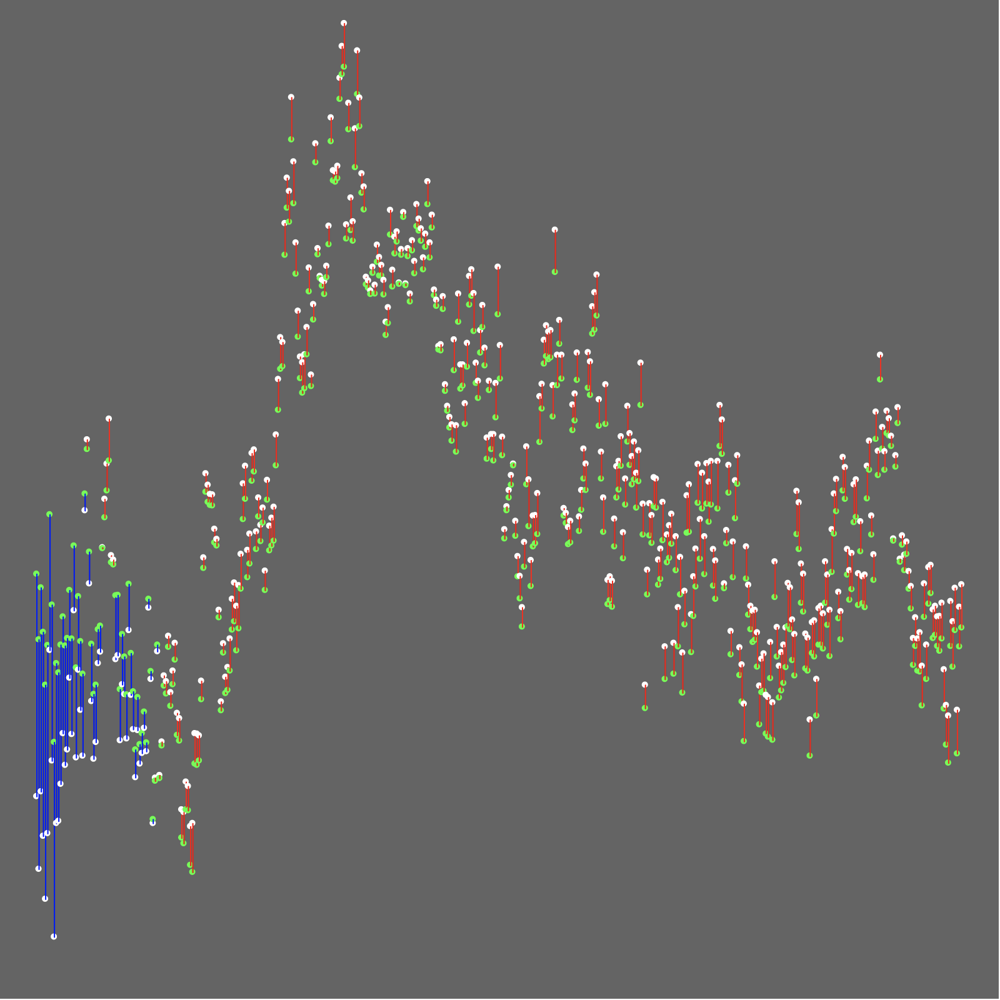
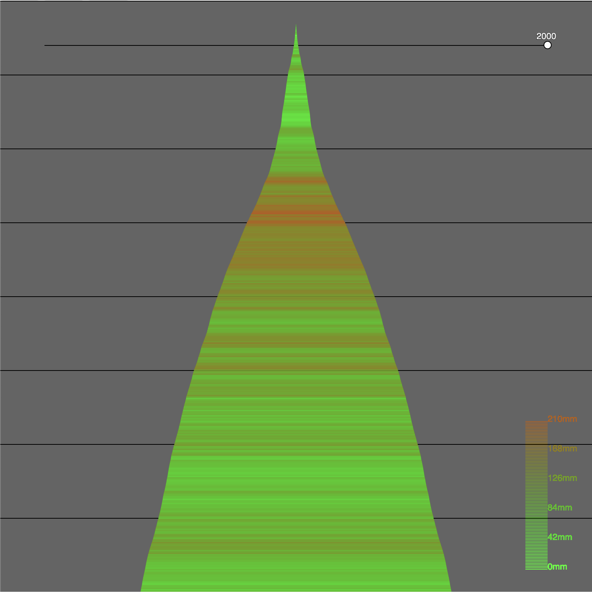

Using the given data set from https://github.com/veev/DataArtFall2019 creates 3 different visualization of the same data sets.  
User can navigate between different visulization by clicking the 3 buttons on the top of the browser.  
Visual 1 is based on the class example from the github page, but I mapped both "RawRingWidth_mm" and "GrowthIndex" on the same graph and comepare the relation between with different colors.  
  
Visual 2 animate the "RawRingWidth_mm" from year 1579 to year 2000 so user can see the change over time.  
  
Visual 3 runs an animation of a stack that grows higher and higher by adding the width of the newest year running from year 1579 to year 2000.  
  
